<div align="center">

# 🛠️ AIWerkstatt

### Your own self-hosted AI app workshop.
**Talk to a coding agent in plain language — watch it build, deploy, and live-serve a real web app you can keep nudging.**

One `docker compose up`. Any AI provider. Runs on your machine — Windows, macOS, Linux.

[](LICENSE)
[](https://www.docker.com/)
[](#-connect-your-ai-provider)
[](#-quickstart-1-minute)

</div>

---

> **AIWerkstatt** turns a coding agent into a workshop you *own*. Instead of copy-pasting
> snippets from a chat window, you send a request — *"build me a habit tracker with a
> weekly chart"* — and AIWerkstatt spins up an isolated agent, lets it build a full web app,
> deploys it live on your machine, and shows you the result with a link you can open.
> Not happy? Just say so in the same thread; the agent keeps working on it.

It’s the friendly front-end you wish coding agents came with: a project gallery, chat-style
task threads with a live activity ticker, a file browser, and — critically — **it’s yours**.
No SaaS, no lock-in, no data leaving your box. Bring your own AI key.

## 📸 See it in action

<div align="center">

**Watch the agent work — every step it takes — and jump in any time. It builds, deploys, and keeps going as you chat. Stop or steer it whenever.**

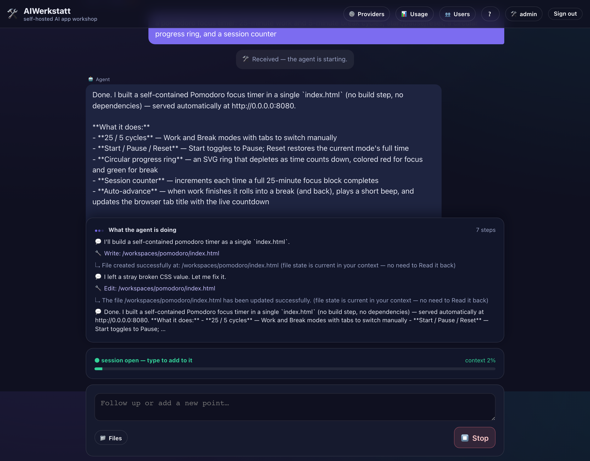

</div>

| The agent at work, across the project | The finished conversation |
|:---:|:---:|
| 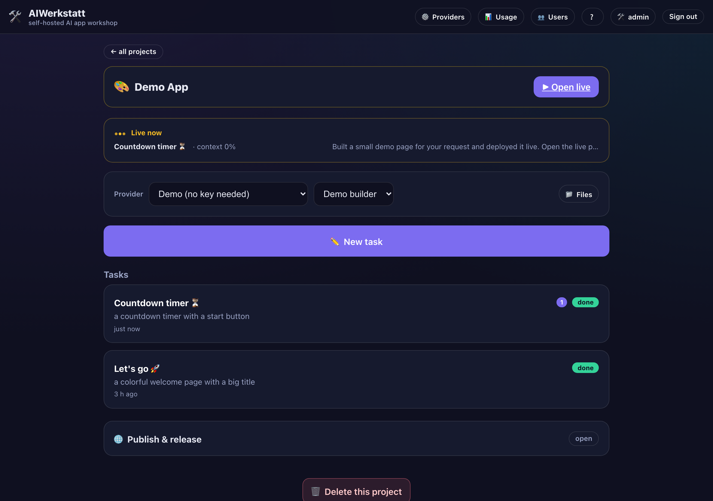 | 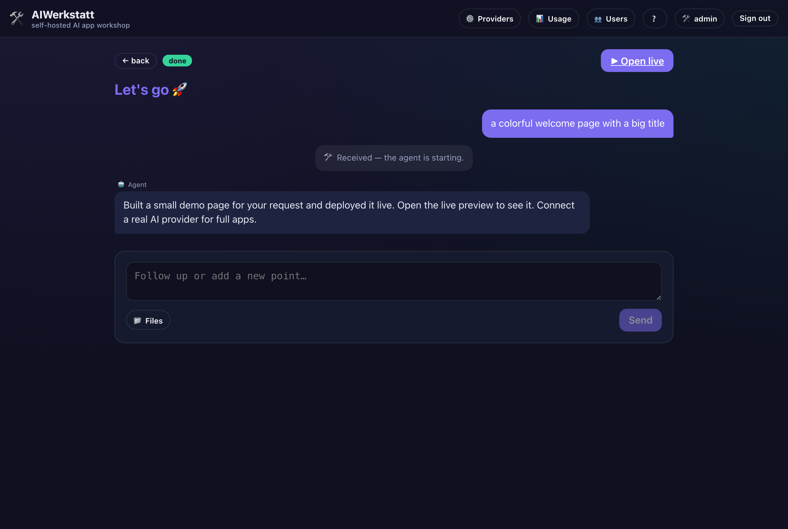 |
| **Your project gallery** | **Inside a project** |
| 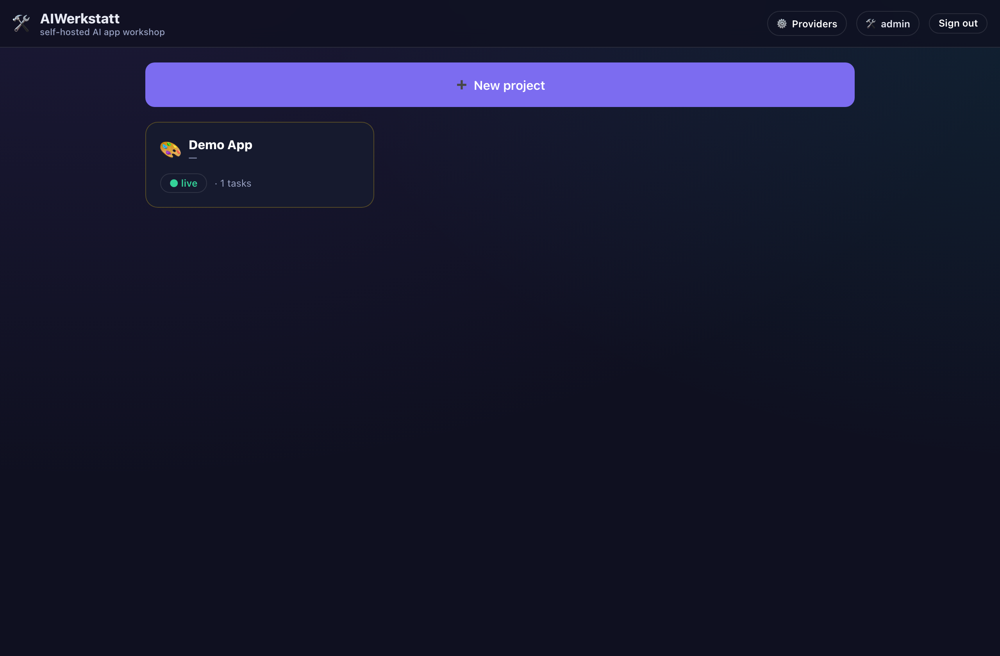 | 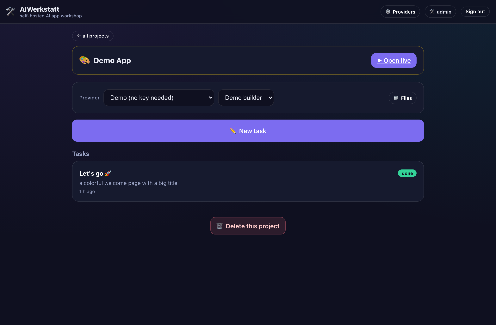 |
| **Connect any AI provider** | **The live app it built** |
| 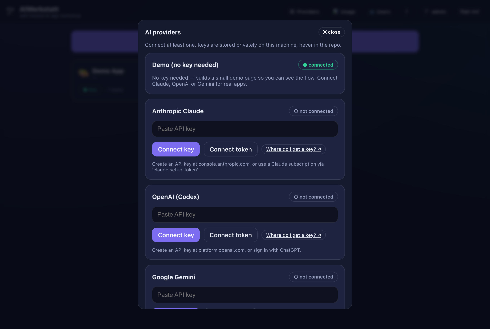 | 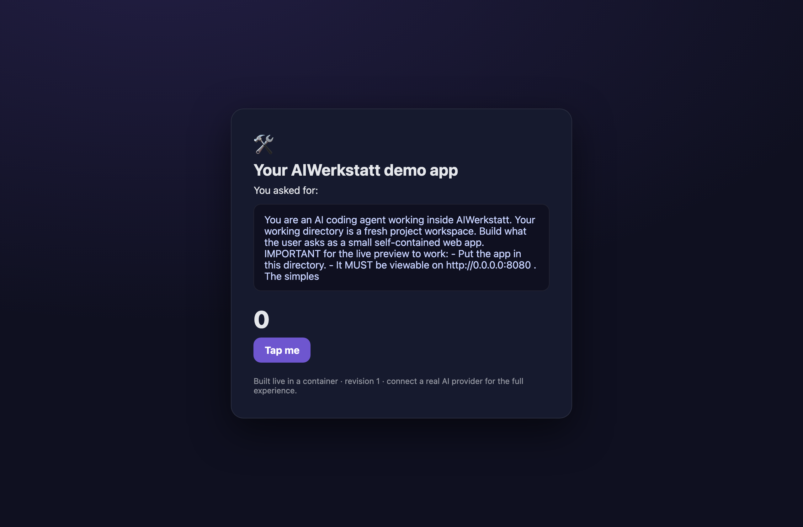 |
| **Publish — leak-scanned first** | **See what it costs** |
| 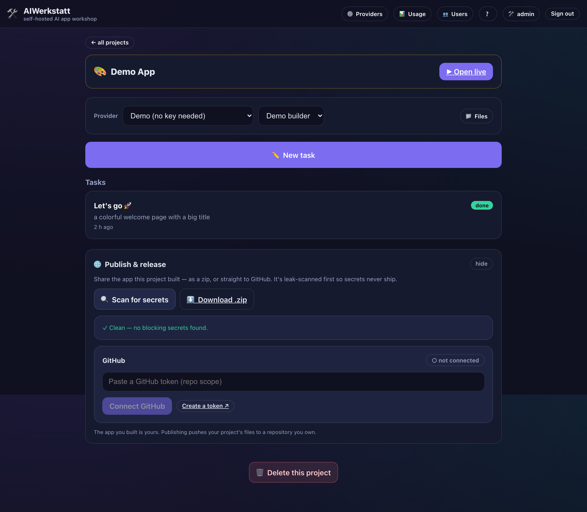 | 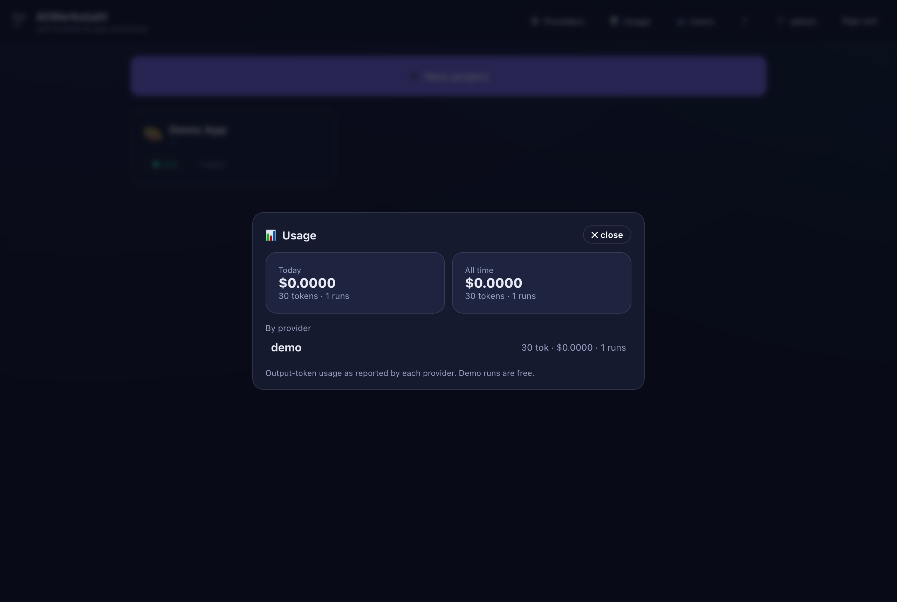 |
| **Manage your household or team** | **Your account &amp; PIN** |
| 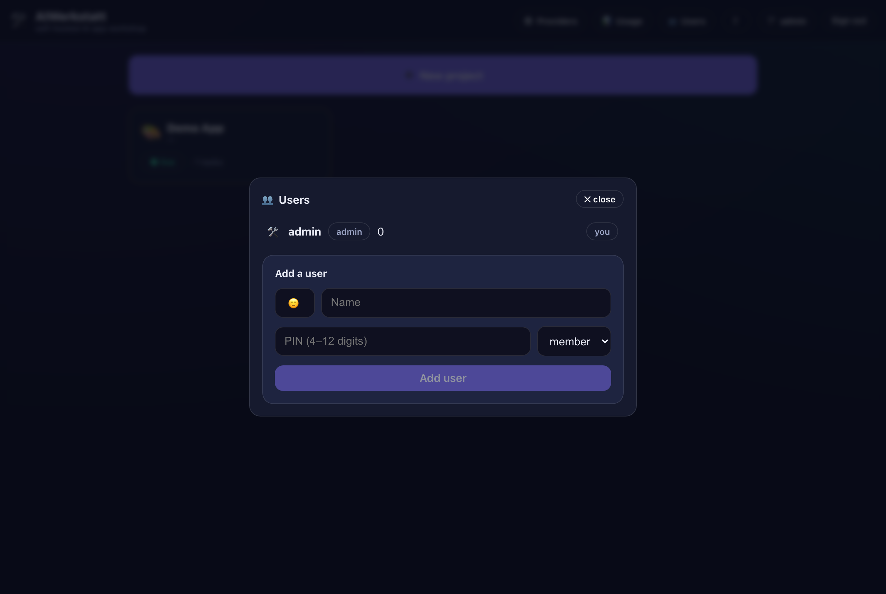 | 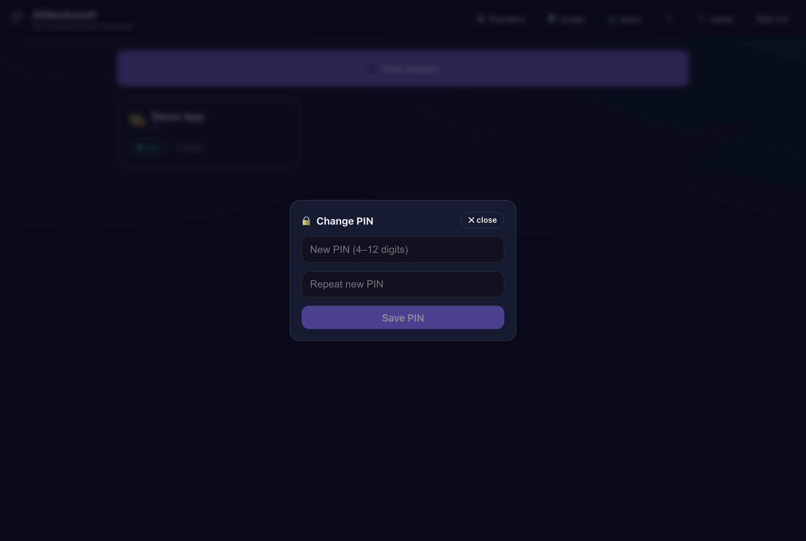 |
| **A short first-run guide** | **Simple PIN sign-in** |
| 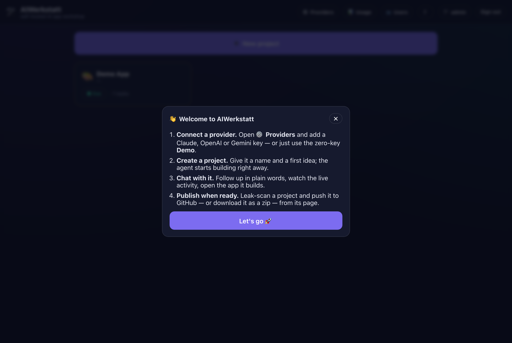 | 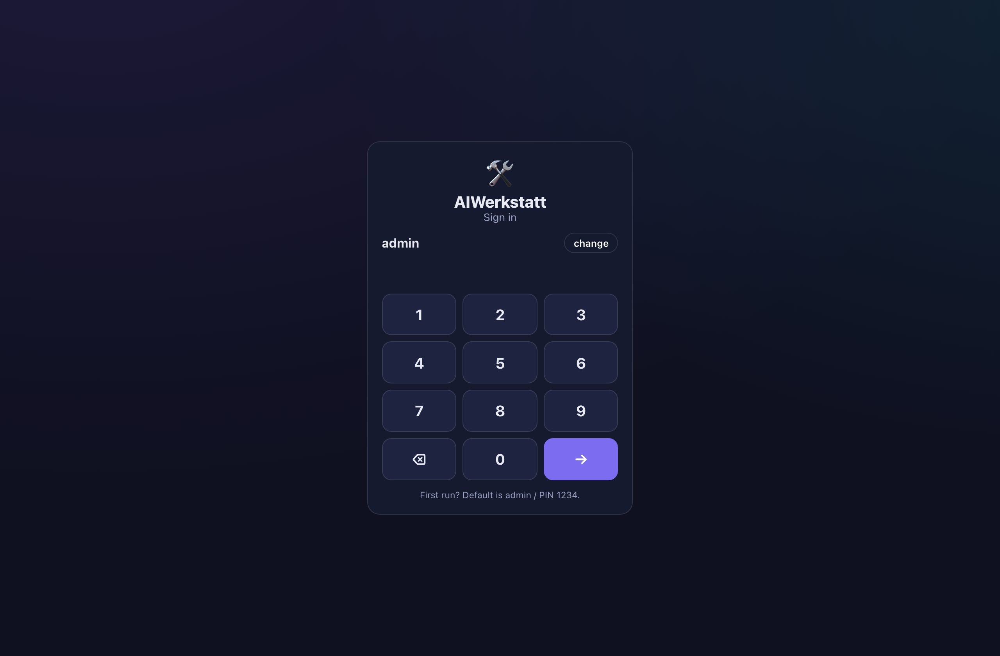 |

## ✨ Why AIWerkstatt

- **🖱️ One-click install.** Download the release zip, unzip, and **double-click the launcher for your OS** — it builds everything, starts it, and opens your browser. No command line. (Prefer the terminal? `docker compose up -d --build` still works.) Windows, macOS, Linux.
- **🔌 Bring any AI provider.** Anthropic Claude, OpenAI, and Google Gemini out of the box — pick per project. Adding another is a small plug-in.
- **💬 Chat, don’t prompt-engineer.** Describe what you want like you’d tell a person. Follow up mid-run — the agent folds your note into what it’s already doing.
- **👀 Watch it work, step by step.** A live feed shows what the agent says, thinks, and does — every file it writes, every command it runs — as it happens. Jump in or hit Stop any time.
- **📦 Isolated by design.** Every agent run and every app it builds runs in its **own container**. The agent can’t touch your machine, only its workspace.
- **🚀 Live apps, instantly.** Each project deploys to a local port and gets a “open live” link. Watch it come together.
- **🗂️ See everything.** Live activity ticker, full file browser, context meter with one-click compaction, stop button, unread markers — all the controls, none of the terminal.
- **🚀 Publish in a click.** Download a project as a zip, or push it straight to a GitHub repo you own — **leak-scanned first** so secrets and private data never ship.
- **📊 Know what it costs.** A usage view tracks output tokens and cost per provider, today and all-time. The zero-key demo is free.
- **👥 Bring your household or team.** PIN logins, an admin user manager, and per-user unread badges — everyone shares the same workshop.

## 🚀 Quickstart

**The one prerequisite:** [Docker Desktop](https://www.docker.com/products/docker-desktop/) (Windows/macOS) or Docker Engine (Linux). Install it once — everything else is automatic.

### 🖱️ One-click (no command line)

1. **Download** the latest release zip from the [Releases page](https://github.com/robeertm/AIWerkstatt/releases/latest) → **Source code (zip)**.
2. **Unzip** it anywhere.
3. **Double-click the launcher for your system** — it builds everything and opens the app for you:
   - **macOS** → `AIWerkstatt.command`  *(first time only: right-click → Open, to get past Gatekeeper)*
   - **Windows** → `AIWerkstatt.bat`
   - **Linux** → `AIWerkstatt.sh`  *(or `./AIWerkstatt.sh` in a terminal)*

The first run builds the images (a few minutes); after that it starts in seconds and your browser opens at **http://localhost:8095**. Create your admin login, connect a provider (below), and send your first request. 🎈 *(Stop it later with `docker compose down` in that folder, or just quit Docker.)*

### ⌨️ Or from the command line

```bash
git clone https://github.com/robeertm/AIWerkstatt.git
cd AIWerkstatt
docker compose up -d --build      # build + start, then open http://localhost:8095
```

## 🔌 Connect your AI provider

On first run AIWerkstatt asks you to connect at least one provider. Your key is stored
**encrypted in the app’s private volume** — never in the repo, never sent anywhere but the
provider you chose. Pick per project which provider and model to use.

| Provider | How to connect | Get a key |
|---|---|---|
| **Anthropic Claude** | API key *or* a Claude subscription (`claude setup-token`) | [console.anthropic.com](https://console.anthropic.com/settings/keys) |
| **OpenAI** | API key *or* ChatGPT sign-in | [platform.openai.com](https://platform.openai.com/api-keys) |
| **Google Gemini** | API key *or* Google sign-in | [aistudio.google.com](https://aistudio.google.com/apikey) |

> Don’t have a key yet? Each connect screen links straight to the page where you create one,
> with a short step-by-step. It takes about a minute.

## 🧠 How it works

```
            ┌─────────────────────────────────────────────┐
   browser ─┤  web  (control plane: UI + API + orchestrator)│
            └───────┬───────────────────────────┬──────────┘
                    │ talks to Docker ONLY via   │ shared named volumes
                    ▼ the hardened socket proxy  ▼ (workspace + events)
            ┌───────────────┐          ┌──────────────────────┐
            │  dockerproxy  │  starts  │  agent-runner (per run)│
            │ (min. surface)│─────────▶│  provider CLI + stream │
            └───────────────┘          └──────────────────────┘
                    │ starts
                    ▼
            ┌──────────────────────┐
            │  your live app        │  ← opens at http://localhost:<port>
            └──────────────────────┘
```

- The **web** container never touches the raw Docker socket — only a hardened
  [socket proxy](docs/security.md) with a minimal allowed API surface.
- Each **agent run** gets its own throwaway container with the provider CLI; it works in an
  isolated **workspace volume** and streams progress back over a shared **events volume**.
- The **app the agent builds** runs as a sibling container and is served live locally.

More detail: [docs/architecture.md](docs/architecture.md) · [docs/providers.md](docs/providers.md) · [docs/security.md](docs/security.md)

## 🔐 Security

AIWerkstatt is built to run **on your own machine for you** — not as a multi-tenant SaaS.
The agent is contained, the Docker socket is proxied down to a minimal surface, and a
deterministic leak scanner guards anything you choose to publish. Read
[docs/security.md](docs/security.md) before exposing it beyond localhost.

## 💬 Feedback

Bug reports and feature ideas are very welcome — please [open an issue](https://github.com/robeertm/AIWerkstatt/issues).
Missing an AI provider? That's one of the most useful things to ask for. See [CONTRIBUTING.md](CONTRIBUTING.md)
for how the pieces fit and how to run your own local build.

## 📄 License

**Source-available — free to run, not for redistribution.** © 2026 Robert Manuwald.
You may download and run AIWerkstatt for your own personal or internal use. Modifying,
redistributing, or hosting it for others is not permitted without written permission.
The apps *you* build with it are yours. See [LICENSE](LICENSE).
